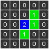

## Техническое руководство по созданию Tetris на C# MAUI

### 1. Введение

В рамках проектной практики была выбрана тема: полное воспроизведение и перенос классической реализации игры Tetris, написанной на языке C++, в современную кроссплатформенную среду .NET MAUI с использованием языка C#. Цель работы заключалась не только в том, чтобы воспроизвести механику игры, но и изучить процесс адаптации кода между разными языками и технологическими стеками.

----------

### 2. Описание оригинального руководства

В качестве основы был выбран текстовый документ _"Tetris tutorial in C++.docx"_, содержащий подробный пошаговый разбор реализации Tetris на языке C++.

#### Основные особенности оригинальной реализации:

-   Логика игры построена на простых структурах и массиве `mBoard[BOARD_WIDTH][BOARD_HEIGHT]`;
    
-   Хранение и повороты фигур реализованы с помощью 4D-массива;
    
-   Вся графика, управление и таймеры завязаны на сторонние библиотеки;

----------

### 4. Цель и подход к адаптации

Так как оригинальный код был логически прозрачен, но технически устарел, было принято решение использовать его как **алгоритмическую основу**, повторяя основную структуру и механику, но переписать на языке C# с применением .NET MAUI.

----------

### 5. Анализ и перенос структуры

#### Оригинальная логика:

-   4D-массив для фигур `pieces[7][4][5][5]`
    
-   Метод `IsPossibleMovement()` для проверки перемещений
    
-   Метод `StorePiece()` для размещения на доске
    
-   Логика появления новой фигуры через `CreateNewPiece()`
    

#### В C# MAUI:

-   Класс `Pieces` реализует тот же 4D-массив с фигурами
    
-   Класс `Board` содержит `mBoard`, `IsPossibleToMovement()`, `StorePiece()`
    
-   Класс `GameManager` управляет текущей и следующей фигурой
    
-   Отрисовка через `TetrisDrawable` и `GraphicsView`
    

----------

### 6. Основные вызовы при портировании

-   Работа с массивами: [x,y] против [y,x]
    
-   Отслеживание координат: MAUI использует пиксели, C++ — логические блоки
    
-   Таймеры: вместо `sleep` и событий используется `System.Timers.Timer`
    
-   Отрисовка: ручная реализация с `ICanvas` и `Drawable`
    

----------

### 7. Техническое руководство по созданию Tetris на C# MAUI

Далее представлено пошаговое руководство по реализации Tetris на C# MAUI на основе C++ руководства _"Tetris tutorial in C++.docx"_. **Руководство ориентировано на начинающих, поэтому здесь реализуются основной необходимый функционал.**

#### Шаг 1: Структура проекта

Создайте новый проект MAUI:

```bash
dotnet new maui -n TetrisGame

```

Нам необходимо добавить следующие файлы и классы:

-   `Pieces.cs`
    
-   `Board.cs`
    
-   `GameManager.cs`
    
-   `TetrisDrawable.cs`
    
-   `MainPage.xaml`, `MainPage.xaml.cs`
    
-   `App.xaml`, `App.xaml.cs`
    
 
Диаграмма отображает связи между ключевыми классами: `Pieces`, `Board`, `GameManager`, `TetrisDrawable` и `MainPage`. Взаимодействие построено вокруг `GameManager`, который управляет состоянием игры и передаёт данные на отрисовку.
#### Шаг 2: Класс Pieces — хранение фигур

Цитата из оригинала: _"Each piece is defined in a 5x5 matrix, for every rotation state (4 in total)"_

В файле `Pieces.cs` реализуйте 4D-массив:

```csharp
private readonly int[,,,] mPieces = new int[7, 4, 5, 5] { ... };

```
Фигуры хранятся данным образом, где 0 = без блока, 1 = обычный блок, 2 = опорный блок:

 

 
Также мы прописываем все повороты каждой фигуры:

 

Также создайте массив смещений для корректной инициализации фигур:

```csharp
private readonly int[,,] mPiecesInitialPosition = new int[7, 4, 2] { ... };

```

Реализуйте методы:
   
 ```csharp
	    public int GetBlockType(int pPiece, int pRotation, int pX, int pY)
        {
            return mPieces[pPiece, pRotation, pX, pY];
        }
        public int GetXInitialPosition(int pPiece, int pRotation)
        {
            return mPiecesInitialPosition[pPiece, pRotation, 0];
        }
        public int GetYInitialPosition(int pPiece, int pRotation)
        {
            return mPiecesInitialPosition[pPiece, pRotation, 1];
        }
```

#### Шаг 3: Класс Board — логика поля

Класс `Board` — это основа логики поля игры. Он отвечает за хранение состояния клеток, проверку возможности движения фигур, сохранение упавших фигур и удаление заполненных линий.
Цитата: _"This class is responsible for checking if a movement is valid, storing a piece, and deleting lines."_

В `Board.cs`:

-   создайте `mBoard[10, 20]`
    
-   реализуйте методы:
    
    -   `InitBoard()` — инициализация поля
        
    -   `IsFreeBlock()` — проверка ячейки
        
    -   `StorePiece()` — сохранение фигуры
        
    -   `IsPossibleToMovement()` — проверка допустимости движения
        
    -   `DeletePossibleLines()` — удаление линий
        
    -   `IsGameOver()` — проверка на окончание игры
        


#### Структура класса

```csharp
namespace TetrisGame
{
    public class Board
    {
        private const int BOARD_WIDTH = 10;
        private const int BOARD_HEIGHT = 20;
        private const int PIECE_BLOCKS = 5;

        private const int POS_FREE = 0;
        private const int POS_FILLED = 1;

        public readonly int[,] mBoard = new int[BOARD_WIDTH, BOARD_HEIGHT];
        public readonly Pieces mPieces;

        public Board(Pieces pieces)
        {
            mPieces = pieces;
            InitBoard();
        }

```
#### Инициализация поля

```csharp
        public void InitBoard()
        {
            for (int y = 0; y < BOARD_HEIGHT; y++)
            {
                for (int x = 0; x < BOARD_WIDTH; x++)
                {
                    mBoard[x, y] = POS_FREE;
                }
            }
        }

```

#### Проверка клетки

```csharp
        public bool IsFreeBlock(int x, int y)
        {
            return mBoard[x, y] == POS_FREE;
        }

```


#### Сохранение фигуры

```csharp
        public void StorePiece(int x, int y, int pPiece, int pRotation)
        {
            for (int i1 = x, i2 = 0; i1 < x + PIECE_BLOCKS; i1++, i2++)
            {
                for (int j1 = y, j2 = 0; j1 < y + PIECE_BLOCKS; j1++, j2++)
                {
                    if (mPieces.GetBlockType(pPiece, pRotation, i2, j2) != 0)
                    {
                        mBoard[i1, j1] = POS_FILLED;
                    }
                }
            }
        }

```

> Каждая фигура — это 5x5-матрица. Этот метод пробегает по ней, и если на позиции `i2, j2` стоит блок, то записывает `1` в массив `mBoard`.

#### Проверка возможности движения

```csharp
        public bool IsPossibleToMovement(int x, int y, int pPiece, int pRotation)
        {
            for (int i1 = x, i2 = 0; i1 < x + PIECE_BLOCKS; i1++, i2++)
            {
                for (int j1 = y, j2 = 0; j1 < y + PIECE_BLOCKS; j1++, j2++)
                {
                    if (i1 < 0 || i1 >= BOARD_WIDTH || j1 >= BOARD_HEIGHT)
                    {
                        if (mPieces.GetBlockType(pPiece, pRotation, i2, j2) != 0)
                            return false;
                    }

                    if (j1 >= 0 && mPieces.GetBlockType(pPiece, pRotation, i2, j2) != 0 &&
                        !IsFreeBlock(i1, j1))
                    {
                        return false;
                    }
                }
            }
            return true;
        }

```

> Метод проверяет, влезает ли фигура в границы поля и не налетает ли на занятые клетки.

#### Удаление линий

```csharp
        public void DeleteLine(int y)
        {
            for (int j = y; j > 0; j--)
            {
                for (int i = 0; i < BOARD_WIDTH; i++)
                {
                    mBoard[i, j] = mBoard[i, j - 1];
                }
            }

            for (int i = 0; i < BOARD_WIDTH; i++)
            {
                mBoard[i, 0] = POS_FREE;
            }
        }

        public int DeletePossibleLines()
        {
            int deleted = 0;
            for (int y = 0; y < BOARD_HEIGHT; y++)
            {
                bool full = true;
                for (int x = 0; x < BOARD_WIDTH; x++)
                {
                    if (mBoard[x, y] == POS_FREE)
                    {
                        full = false;
                        break;
                    }
                }
                if (full)
                {
                    DeleteLine(y);
                    deleted++;
                }
            }
            return deleted;
        }

```

> Если строка заполнена полностью, она удаляется, а все строки выше сдвигаются вниз.

#### Проверка конца игры

```csharp
        public bool IsGameOver()
        {
            for (int x = 0; x < BOARD_WIDTH; x++)
            {
                if (mBoard[x, 0] == POS_FILLED)
                    return true;
            }
            return false;
        }
    }
}

```

> Если в верхней строке есть заполненные клетки — игра окончена.


#### Шаг 4: GameManager — управление игрой

В `GameManager.cs` реализуется логика выбора текущей и следующей фигуры:

-   Свойства: `CurrentPiece`, `CurrentX`, `CurrentY`, `NextPiece`, `Score`, `Lines`, `Level`
    
-   Методы:
    
    -   `InitGame()`
        
    -   `CreateNewPiece()`
        
####  Объявление и структура класса

```csharp
namespace TetrisGame
{
    public class GameManager
    {
        private const int BOARD_WIDTH = 10;

        public readonly Pieces pieces;
        private readonly Board board;
        private readonly Random random;

        public Board Board => board; // Для доступа в отрисовке

        public int CurrentPiece;
        public int CurrentRotation;
        public int CurrentX;
        public int CurrentY;

        public int Score { get; set; }
        public int Lines { get; set; }
        public int Level => Lines / 10 + 1;

        private int nextPiece;
        private int nextRotation;

```

#### Объяснение:

-   `CurrentPiece` — индекс текущей фигуры (0–6).
    
-   `CurrentRotation` — текущий поворот (0–3).
    
-   `CurrentX` и `CurrentY` — позиция фигуры на поле.
    
-   `nextPiece` и `nextRotation` — заготовка следующей фигуры.
    
-   `Score`, `Lines`, `Level` — игровая статистика.
    

#### Конструктор и инициализация

```csharp
        public GameManager(Board board, Pieces pieces)
        {
            this.pieces = pieces;
            this.board = board;
            random = new Random();

            InitGame();
        }

```

> Сохраняет ссылки на `Board` и `Pieces`, создаёт генератор случайных чисел, запускает начальную игру.

```csharp
        private int GetRand(int a, int b)
        {
            return random.Next(a, b + 1);
        }

```

> Метод-обёртка для генерации случайных чисел от `a` до `b` включительно.

#### Метод InitGame — старт новой игры

```csharp
        public void InitGame()
        {
            CurrentPiece = GetRand(0, 6);
            CurrentRotation = GetRand(0, 3);
            CurrentX = (BOARD_WIDTH / 2) + pieces.GetXInitialPosition(CurrentPiece, CurrentRotation);
            CurrentY = pieces.GetYInitialPosition(CurrentPiece, CurrentRotation);

            nextPiece = GetRand(0, 6);
            nextRotation = GetRand(0, 3);

            Score = 0;
            Lines = 0;
        }

```

> Выбирает первую фигуру и следующую. Определяет позицию, исходя из смещения, заданного для каждой фигуры (`GetXInitialPosition`). Обнуляет статистику.


#### Метод CreateNewPiece — переход к следующей фигуре

```csharp
        public void CreateNewPiece()
        {
            CurrentPiece = nextPiece;
            CurrentRotation = nextRotation;
            CurrentX = (BOARD_WIDTH / 2) + pieces.GetXInitialPosition(CurrentPiece, CurrentRotation);
            CurrentY = pieces.GetYInitialPosition(CurrentPiece, CurrentRotation);

            nextPiece = GetRand(0, 6);
            nextRotation = GetRand(0, 3);
        }
    }
}

```

----------

#### Шаг 5: Отрисовка — TetrisDrawable
Класс `TetrisDrawable` реализует интерфейс `IDrawable` и отрисовывает:

-   Серую сетку поля.
    
-   Заполненные блоки на поле.
    
-   Текущую активную фигуру.
    

#### Объявление

```csharp
using Microsoft.Maui.Graphics;

namespace TetrisGame
{
    public class TetrisDrawable : IDrawable
    {
        private readonly GameManager game;
        private const int CellSize = 30;

        public TetrisDrawable(GameManager game)
        {
            this.game = game;
        }

        public void Draw(ICanvas canvas, RectF dirtyRect)
        {
            // Сетка
            canvas.FillColor = Colors.DarkGray;
            for (int x = 0; x < 10; x++)
            {
                for (int y = 0; y < 20; y++)
                {
                    canvas.FillRectangle(x * CellSize, y * CellSize, CellSize - 1, CellSize - 1);
                }
            }

            // Заполненные клетки поля
            for (int x = 0; x < 10; x++)
            {
                for (int y = 0; y < 20; y++)
                {
                    if (game.Board.mBoard[x, y] == 1)
                    {
                        canvas.FillColor = Colors.Gray;
                        canvas.FillRectangle(x * CellSize, y * CellSize, CellSize - 1, CellSize - 1);
                    }
                }
            }

            // Активная фигура
            canvas.FillColor = Colors.Cyan;
            for (int i = 0; i < 5; i++)
            {
                for (int j = 0; j < 5; j++)
                {
                    if (game.pieces.GetBlockType(game.CurrentPiece, game.CurrentRotation, i, j) != 0)
                    {
                        int screenX = game.CurrentX + i;
                        int screenY = game.CurrentY + j;
                        canvas.FillRectangle(screenX * CellSize, screenY * CellSize, CellSize - 1, CellSize - 1);
                    }
                }
            }
        }
    }
}

```

----------

#### Шаг 6: Логика таймера и управления

В `MainPage.xaml.cs`:

-   Создайте `Timer` с интервалом (например, 500 мс)
    
-   В методе `OnTimerElapsed` вызывайте:
    
    -   `IsPossibleToMovement()`
        
    -   `StorePiece()` при невозможности движения
        
    -   `CreateNewPiece()` и `Invalidate()` для перерисовки
        
####  Общая структура

```csharp
public partial class MainPage : ContentPage
{
    private System.Timers.Timer fallTimer;
    private Board board;
    private GameManager game;

    public TetrisDrawable TetrisDrawable { get; set; }
    public NextPieceDrawable NextPieceDrawable { get; set; }

```

> Здесь создаются ключевые переменные: таймер, доска, логика игры, объекты для отрисовки.
Добавьте кнопки управления: влево, вправо, вниз, поворот.
#### Конструктор MainPage()

```csharp
    public MainPage()
    {
        InitializeComponent();

        var pieces = new Pieces();
        board = new Board(pieces);
        game = new GameManager(board, pieces);

        TetrisDrawable = new TetrisDrawable(game);
        NextPieceDrawable = new NextPieceDrawable(game);

        BindingContext = this;

        StartTimer();
        UpdateStats();
        GameCanvas.Invalidate();
        NextPieceCanvas.Invalidate();
    }

```
####  Запуск и работа таймера

```csharp
private void StartTimer()
{
    fallTimer = new System.Timers.Timer(500);
    fallTimer.Elapsed += OnTimerElapsed;
    fallTimer.AutoReset = true;
    fallTimer.Start();
}

```

> Таймер срабатывает каждые 500 мс — фигура сдвигается вниз.

```csharp
private void OnTimerElapsed(object sender, ElapsedEventArgs e)
{
    MainThread.BeginInvokeOnMainThread(() =>
    {
        if (board.IsPossibleToMovement(game.CurrentX, game.CurrentY + 1, game.CurrentPiece, game.CurrentRotation))
        {
            game.CurrentY++;
        }
        else
        {
            board.StorePiece(game.CurrentX, game.CurrentY, game.CurrentPiece, game.CurrentRotation);
            int linesCleared = board.DeletePossibleLines();
            if (linesCleared > 0)
            {
                game.Lines += linesCleared;
                game.Score += GetScoreForLines(linesCleared, game.Level);
            }

            if (board.IsGameOver())
            {
                fallTimer.Stop();
                DisplayAlert("Игра окончена", "Ты проиграл", "ОК");
                return;
            }

            game.CreateNewPiece();
            UpdateStats();
        }

        GameCanvas.Invalidate();
        NextPieceCanvas.Invalidate();
    });
}

```

> Обновляется позиция или сохраняется фигура. Если игра окончена — появляется уведомление.


#### Обработка управления

```csharp
private void HandleInput(string input)
{
    switch (input)
    {
        case "Left":
            if (board.IsPossibleToMovement(game.CurrentX - 1, game.CurrentY, game.CurrentPiece, game.CurrentRotation))
                game.CurrentX--;
            break;
        case "Right":
            if (board.IsPossibleToMovement(game.CurrentX + 1, game.CurrentY, game.CurrentPiece, game.CurrentRotation))
                game.CurrentX++;
            break;
        case "Down":
            if (board.IsPossibleToMovement(game.CurrentX, game.CurrentY + 1, game.CurrentPiece, game.CurrentRotation))
                game.CurrentY++;
            break;
        case "Rotate":
            int newRotation = (game.CurrentRotation + 1) % 4;
            if (board.IsPossibleToMovement(game.CurrentX, game.CurrentY, game.CurrentPiece, newRotation))
                game.CurrentRotation = newRotation;
            break;
    }
    GameCanvas.Invalidate();
}

```

```csharp
private void OnLeftClicked(object sender, EventArgs e) => HandleInput("Left");
private void OnRightClicked(object sender, EventArgs e) => HandleInput("Right");
private void OnDownClicked(object sender, EventArgs e) => HandleInput("Down");
private void OnRotateClicked(object sender, EventArgs e) => HandleInput("Rotate");

```


#### Обновление статистики

```csharp
private int GetScoreForLines(int lines, int level)
{
    return lines switch
    {
        1 => 40 * level,
        2 => 100 * level,
        3 => 300 * level,
        4 => 1200 * level,
        _ => 0
    };
}

private void UpdateStats()
{
    ScoreLabel.Text = $"Score: {game.Score}";
    LinesLabel.Text = $"Lines: {game.Lines}";
    LevelLabel.Text = $"Level: {game.Level}";
}

```


----------
#### Шаг 7: XAML-интерфейс

В `MainPage.xaml` разместите `GraphicsView`:

```xml
<GraphicsView x:Name="GameCanvas" Drawable="{Binding TetrisDrawable}" WidthRequest="300" HeightRequest="600" />

```

И кнопки управления:

```xml
<Button Text="◀" Clicked="OnLeftClicked" />
<Button Text="▶" Clicked="OnRightClicked" />
<Button Text="▼" Clicked="OnDownClicked" />
<Button Text="⟳" Clicked="OnRotateClicked" />

```

----------


