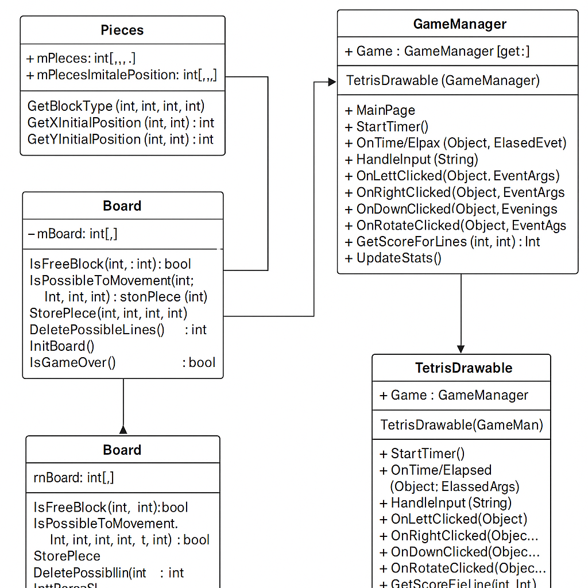

## Воспроизведение и адаптация классической C++ реализации Tetris в C# MAUI

### 1. Введение

В рамках проектной практики была выбрана тема: полное воспроизведение и перенос классической реализации игры Tetris, написанной на языке C++, в современную кроссплатформенную среду .NET MAUI с использованием языка C#. Цель работы заключалась не только в том, чтобы воспроизвести механику игры, но и изучить процесс адаптации кода между разными языками и технологическими стеками.

----------

### 2. Последовательность действий по исследованию предметной области и созданию технологии

Исследование началось с изучения открытого репозитория [codecrafters-io/build-your-own-x](https://github.com/codecrafters-io/build-your-own-x) — это коллекция проектов, где представлены различные технологии, которые можно реализовать "с нуля": компиляторы, интерпретаторы, движки игр, CLI-программы, сети и многое другое.

Мне особенно приглянулись проекты, связанные с игровой логикой. Среди них я обратила внимание на Tetris — казалось бы простая игра, но внутри скрывается множество интересных аспектов: от геометрии и логики столкновений до алгоритмов удаления линий и циклов рендеринга.

Исходным решением стал "Tetris tutorial in C++.docx" по созданию Тетриса вручную, без использования фреймворков. Мне понравился его формат: простой подход, наличие структуры хранения фигур и механики управления.

Однако сразу возникло ощущение, что язык C++ хотя и даёт глубокое понимание, но не совсем подходит под мои текущие цели. Я хотела сделать что-то современное, визуально более интересное и главное — работающее на телефоне. На карьерном марафоне мне рассказывали про .NET MAUI — это кроссплатформенная технология от Microsoft, позволяющая создавать приложения под Android, iOS, Windows и Mac из одного кода на C#. Я заинтересовалась: а можно ли перенести C++ реализацию Tetris в .NET MAUI? Это был бы интересный вызов: и сохранение оригинальной логики, и исследование новой технологии, и возможность сделать нечто визуально привлекательное.

Я начала с воспроизведения Tetris по инструкции в C++. Это помогло мне:

-   создать рабочую игру на C++
-    понять, как устроены фигуры (матрицы 5х5);
    
-   как работает поворот и смещение;
    
-   как хранится игровое поле и проверяются коллизии;
    
-   как реализуется логика удаления линий и генерации новой фигуры.
    

После этого я приступила к изучению MAUI:

-   как устроено отрисовывающее пространство (`GraphicsView` и `IDrawable`);
    
-   как можно реализовать игровую логику (`Timer`, `BindingContext`);
    
-   как связать XAML-интерфейс с C#-классами и передавать состояния между ними.
    

Затем начался процесс **адаптации**:

-   Я переписала класс `Pieces`, сохранив 4D-массив фигур и их повороты;

    
-   Создала класс `Board`, полностью повторив структуру `mBoard`, методы `StorePiece()` и `IsPossibleToMovement()` с теми же алгоритмами, что в C++;
    
-   Создала `GameManager`, который управляет текущей и следующей фигурой, реализует генерацию и начальную позицию;
    
-   Отрисовку реализовала через `TetrisDrawable` с использованием `ICanvas`, вручную прорисовывая сетку и блоки.
    

Также я добавила:

-   Отслеживание координат: MAUI использует пиксели, C++ — логические блоки
    
-   Таймеры: вместо `sleep` и событий используется `System.Timers.Timer`
    
-   Отрисовка: ручная реализация с `ICanvas` и `Drawable`

-   XAML-интерфейс: кнопки управления (влево, вправо, поворот, вниз);
    
-   Графический вывод на мобильном экране;
    
-   Отображение статистики: очки, линии, уровень;
    
Я подготовила диаграмму структуры классов для наглядности:
 
Диаграмма отображает связи между ключевыми классами: `Pieces`, `Board`, `GameManager`, `TetrisDrawable` и `MainPage`. Взаимодействие построено вокруг `GameManager`, который управляет состоянием игры и передаёт данные на отрисовку.

----------
Плюсы моего подхода:

-   Создала данную игру в двух версиях, на двух разных языках и платформах;

-   Я не просто "написала Тетрис", а поняла, как **логика алгоритма отделяется от конкретной реализации**;
    
-   Научилась **переосмысливать и переносить код между языками** и архитектурами;
    
-   Овладела основами .NET MAUI и C# для построения визуальных кроссплатформенных приложений;
    
-   Получила работающий мобильный прототип, построенный на ручной логике без игровых движков.
   
   ----------
### 3. Модификация проекта 

Исходный проект был сосредоточен на воссоздании Tetris по классической логике. Однако в процессе освоения .NET MAUI и углубления в особенности C# и XAML я решила расширить игру и добавить в неё дополнительные возможности, которые бы делали приложение современнее и интереснее для пользователя. В частности:

#### 3.1. Расширенный интерфейс пользователя

Был добавлен XAML-интерфейс с полноценной панелью управления, отдельными кнопками для всех основных действий (влево, вправо, вниз, поворот), а также блоками статистики. Это сделало игру более доступной на мобильных устройствах и адаптированной под сенсорное управление.

#### 3.2. Система очков, уровней и адаптивной сложности

Введены базовые игровые метрики: количество сброшенных линий, текущий счёт и уровень. При достижении определённого количества линий скорость падения увеличивается, что делает игру сложнее и динамичнее. Это позволяет реализовать элемент геймификации и добавить чувство прогресса.

#### 3.3. Отрисовка следующей фигуры

Была добавлена панель предварительного просмотра следующей фигуры (NextPieceDrawable), что также повторяет механику оригинального Tetris и даёт игроку возможность планировать свои действия заранее. Это дополнение реализовано как отдельный `GraphicsView`, связанный с текущим состоянием `GameManager`.

#### 3.4. Адаптация под Android

Особое внимание было уделено тому, чтобы проект успешно запускался на физическом Android-устройстве. Для этого потребовалось разобраться в особенностях Android-целей, настройке `TargetFrameworks`, установке MAUI-Workload и устранении проблем сборки. Результатом стал стабильный запуск Tetris на смартфоне.

#### 3.5. Подготовка к расширению логики

В коде предусмотрены возможности для добавления новых функций:

-   пауза и сброс игры;
    
-   выбор начального уровня;
    
-   сохранение лучших результатов и статистики;
    
-   визуальная анимация исчезающих линий.
    

#### 3.6. Исследование и сравнение разных стратегий отрисовки

Для отрисовки фигур использовался `ICanvas` и ручное рисование блоков. В процессе я изучала и альтернативные подходы — например, использование `SkiaSharp` или XAML-объектов (например, `BoxView`). Это позволило понять плюсы и минусы разных подходов к визуализации и сделать вывод, что низкоуровневый `Drawable` остаётся наиболее гибким и контролируемым вариантом для игр такого типа.

----------

### В дальнейшем я планирую доработать проект, добавив:

-   цветные блоки;
    
-   переход между уровнями, паузу и звуки.

-   пауза и сброс игры;
    
-   выбор начального уровня;
    
-   сохранение лучших результатов и статистики;
    
-   визуальная анимация исчезающих линий.

----------

